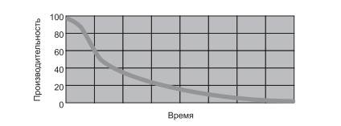
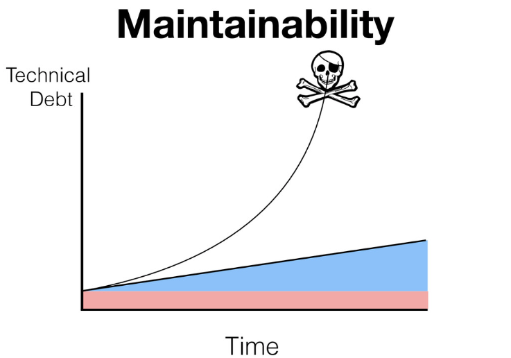

# clean-architecture

Репозиторий, предназначенный для примеров и описаний принципов грамотной архитектуры и паттернов проектирования.
## Цель

По мере накопления хаоса в коде производительность группы начинает снижаться, асимптотически приближаясь к нулю. В ходе снижения производительности
начальство делает единственное, что оно может сделать: подключает к проекту
новых работников в надежде повысить производительность. Но новички ничего
не понимают в архитектуре системы. Они не знают, какие изменения соответствуют намерениям проектировщика, а какие им противоречат. Более того,
они — и все остальные участники группы — находятся под страшным давлением
со стороны начальства. В спешке они работают все небрежнее, отчего производительность только продолжает падать

Наша задача, как разработчиков, минимизировать хаос, количество технического долга и реализовывать поддерживаемые и тестируемые приложения.

Поддерживаемость определяется отсутствием (или минимизацией) технического долга. 
Поддерживаемым будет то приложение, при изменении которого мы будем получать минимально возможный уровень 
технического долга.

Поддерживаемость это концепция, рассчитанная на большие промежутки времени. 
На ранних стадиях разработки с приложением легко работать — оно еще не до конца сформировано и 
разработчики формируют его исходя из своих первоначальных решений. На этом этапе добавление нового 
функционала или библиотек происходит легко и быстро.

Однако с течением времени, работать с приложением становится все сложней. 
Добавление новой функциональности может конфликтовать с уже имеющейся. Баги могут свидетельствовать о более общей 
проблеме, решение которой потребует больших изменений в коде (а также упрощения сложных участков кода).

Закладывая хорошую архитектуру на ранних этапах мы можем предотвратить эти проблемы.

Если на каждой итерации разработки мы будем оставлять хотя-бы крупицы технического долга, то в итоге его график перерастет 
к экспоненциальной зависимости, и приложение скоропостижно умрет

## Паттерны
* [Proxy](pattern/src/main/java/proxy/README.md)
* [Decorator](pattern/src/main/java/decorator/README.md)
## Архитектурные принципы
### SOLID
* [Single Responsibility Principle (Принцип единственной ответственности);](./architecture/src/main/java/solid/srp/README.md)
* [Open-Closed Principle (Принцип открытости-закрытости);](./architecture/src/main/java/solid/ocp/README.md)
* [Liskov Substitution Principle (Принцип подстановки Барбары Лисков);](./architecture/src/main/java/solid/lsp/README.md)
* [Interface Segregation Principle (Принцип разделения интерфейса);](./architecture/src/main/java/solid/isp/README.md)
* [Dependency Inversion Principle (Принцип инверсии зависимостей).](./architecture/src/main/java/solid/dip/README.md)
### KISS
* [Keep It Simple Stupid (KISS)](./architecture/src/main/java/kiss/README.md)
### DRY
* [Dont Repeat Yourself](./architecture/src/main/java/dry/README.md)
### YAGNI
* [You Arent Gonna Need It](./architecture/src/main/java/yagni/README.md)
### Ports & Adapters Architecture
* [Hexagonal architecture](./src/main/java/hexagonal_architecture/README.md)
### Clean Architecture
* [Clean architecture](./src/main/java/clean_architecture/README.md)
