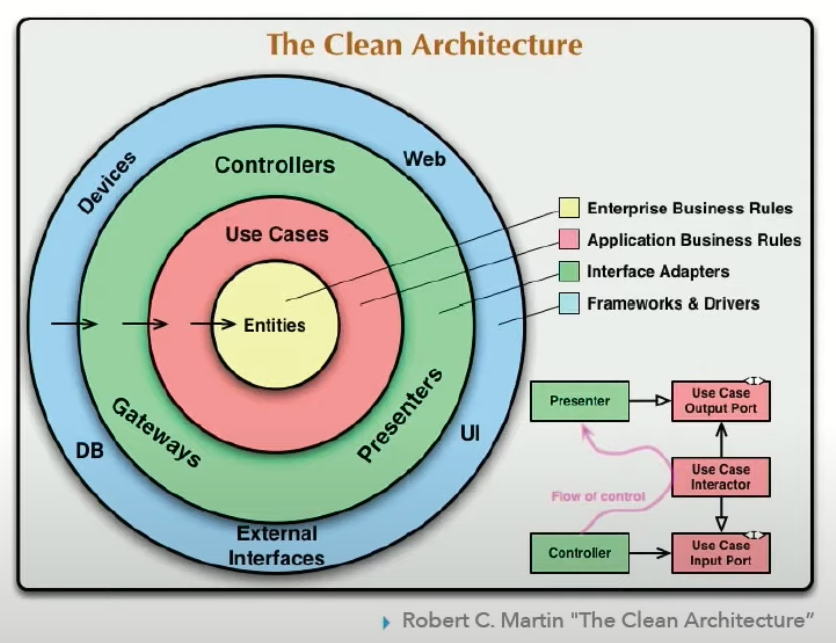
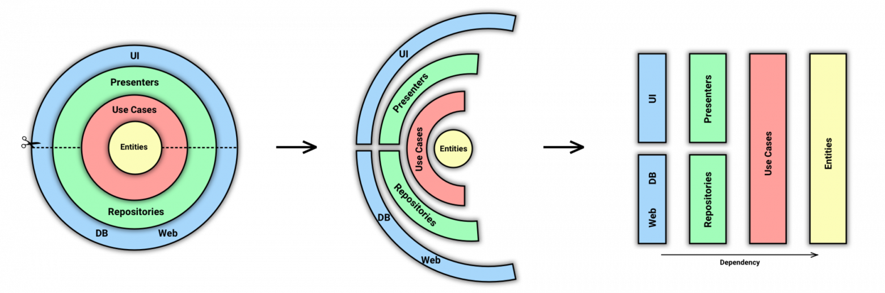

# Чистая архитектура

чистая архитектура является набором принципов, которые направлены на достижение высокой степени разделения 
ответственности между различными элементами программы. Это означает, что каждый компонент программы должен выполнять 
только одну задачу и быть независимым от других компонентов. Преимуществом чистой архитектуры является то, 
что она делает код более гибким и легко поддающимся изменениям или переиспользованию.

## Описание

## Структура
классическое изображение чистой архитектуры 

разрежем слои на части и превратим эту схему в блочную, где цвет будет по-прежнему обозначать принадлежность к слою.

### Слои

Dependency Rule говорит нам, что внутренние слои не должны зависеть от внешних. То есть наша бизнес-логика и логика приложения не должны зависеть от презентеров, UI, баз данных и т.п. На оригинальной схеме это правило изображено стрелками, указывающими внутрь.

* Entities. Бизнес-логика общая для многих приложений - 
Entities инкапсулируют логику бизнеса, то есть всё то, что не зависит от конкретного приложения, а будет общим для многих. 
Но если у вас отдельное приложение и оно не заточено под какой-то существующий бизнес, 
то Entities будут являться бизнес-объектами приложения, содержащими самые общие и высокоуровневые правила.

* Use Cases - это детализация, логика приложения, описание действия, которое может совершить пользователь системы. 

* Interface Adapters. Адаптеры между Use Cases и внешним миром. Сюда попадают Presenter’ы из MVP, 
а также Gateways (более популярное название репозитории).

* Frameworks. Самый внешний слой, тут лежит все остальное: UI, база данных, http-клиент, и т.п.

## Принципы
* Независимость от фреймворка. Архитектура не зависит от существования какой-либо библиотеки. Это позволяет использовать фреймворк в качестве инструмента, вместо того, чтобы втискивать свою систему в рамки его ограничений.
* Тестируемость. Бизнес-правила могут быть протестированы без пользовательского интерфейса, базы данных, веб-сервера или любого другого внешнего компонента.
* Независимоcть от UI. Пользовательский интерфейс можно легко изменить, не изменяя остальную систему. Например, веб-интерфейс может быть заменен на консольный, без изменения бизнес-правил.
* Независимоcть от базы данных. Вы можете поменять Oracle или SQL Server на MongoDB, BigTable, CouchDB или что-то еще. Ваши бизнес-правила не связаны с базой данных.
* Независимость от какого-либо внешнего сервиса. По факту ваши бизнес правила просто ничего не знают о внешнем мире.
## Туториалы

* [Заблуждения Clean Architecture](https://habr.com/ru/companies/mobileup/articles/335382/)
* [Robert C Martin - Clean Architecture](https://www.youtube.com/watch?v=Nltqi7ODZTM)
* [Clean Architecture: Standing on the shoulders of giants](https://herbertograca.com/2017/09/28/clean-architecture-standing-on-the-shoulders-of-giants/)