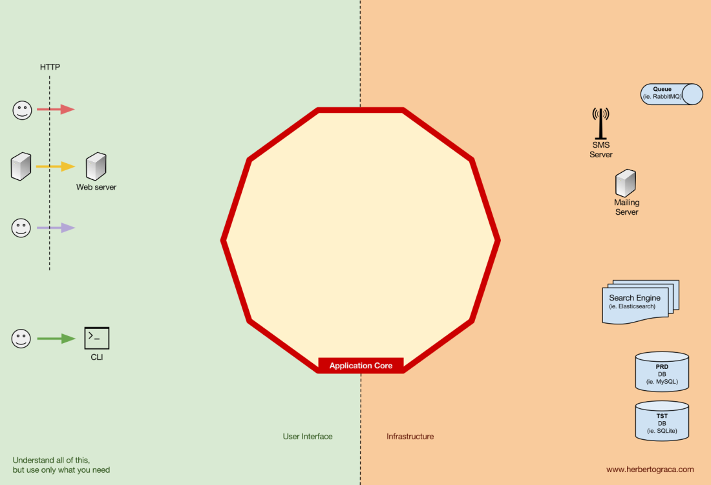
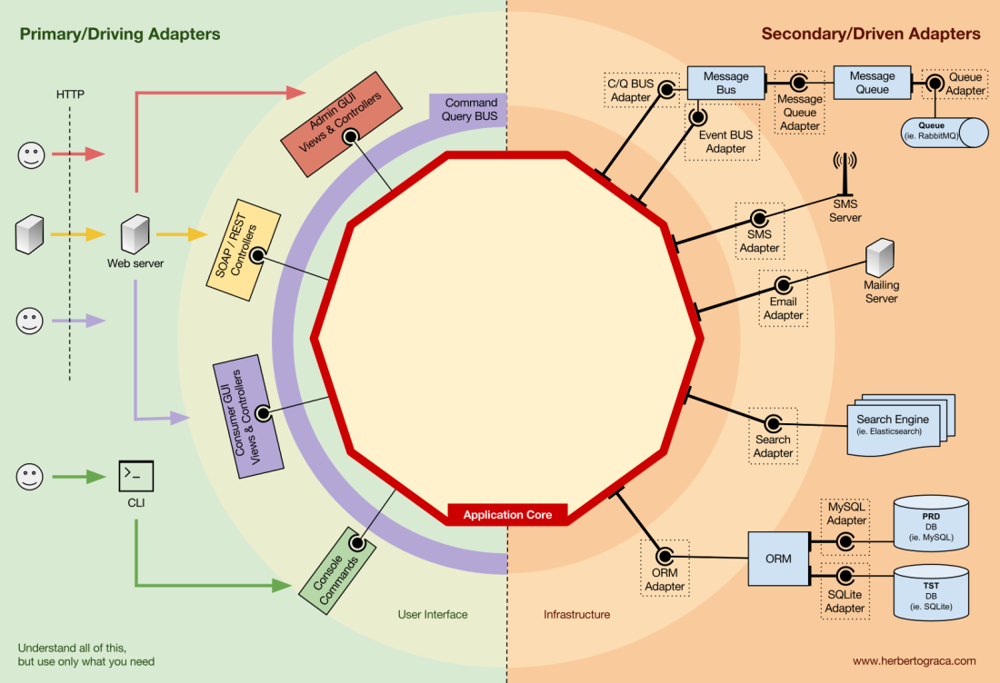
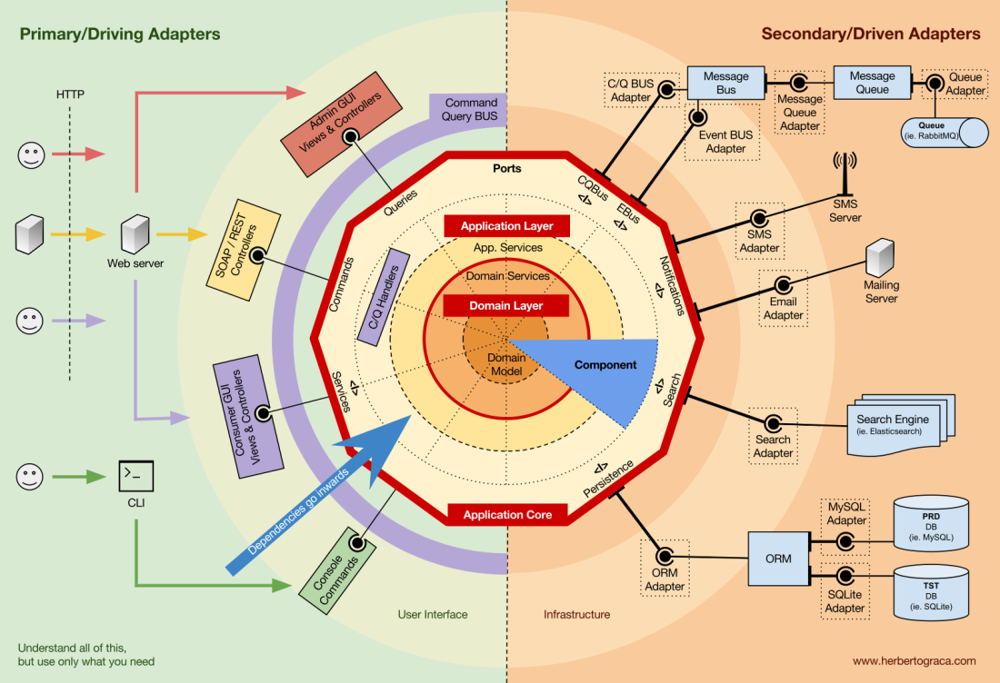
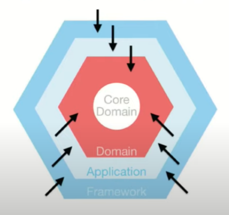

# ГЕКСАГОНАЛЬНАЯ АРХИТЕКТУРА

## Описание
В гексагональной архитектуре мы ставим наши входы и выходы на первый план. 
Это позволяет нам изолировать центральную логику приложения от внешнего мира. 
Поскольку наши входы и выходы находятся на грани, мы можем переключать их обработчики, не затрагивая наш основной код.
Гексагональная архитектура направлена на повышение ремонтопригодности наших веб-приложений, 
чтобы наш код потребовал меньше работы в целом. Шестиугольная архитектура представлена шестиугольником. 
Каждая из сторон шестиугольника представляет разные способы взаимодействия нашей системы с другими системами. 
Мы могли общаться, используя HTTP-запросы, REST API, SQL, другие шестиугольные архитектуры и т.д. 
Каждый уровень шестиугольника не зависит от других слоев, поэтому мы можем вносить индивидуальные изменения, 
не затрагивая всю систему.

~~~~~~~~
Пример реализации гексагональной архитектуры на Java можно найти в проекте Spring Boot. 
В этом проекте ядро приложения представлено сервисами, а адаптеры - контроллерами и репозиториями. 
Контроллеры предоставляют REST API для взаимодействия с внешним миром, а репозитории используются для доступа 
к базе данных.
~~~~~~~~

### Слои

#### Фундаментальные блоки системы

На данном изображении показана структура приложения:
* То, что позволяет запускать пользовательский интерфейс, независимо от его типа.
* Системная бизнес-логика или ядро приложения. Его использует UI для совершения реальных транзакций.
* Код инфраструктуры, который соединяет ядро нашего приложения с такими инструментами, как БД, поисковая система или сторонние API.




В гексагональной архитектуре взаимосвязь слоев производится благодаря портам и адаптерам, где порты - интерфейсы, а адаптеры - 
их реализации. Портами являются только те интерфейсы, что лежат на границах слоев.
Адаптеры, которые говорят приложению что-то делать, называются первичными или управляющими адаптерами,
в то время как адаптеры, которым приложение говорит что-то делать, называются вторичными или управляемыми адаптерами.

Порт — это не более чем спецификация того, как инструмент может использовать ядро приложения или наоборот. В большинстве 
языков и в простейшем виде этот порт будет интерфейсом, но фактически он может быть составлен из нескольких интерфейсов и DTO.

Важно отметить, что порты (интерфейсы) находятся внутри бизнес-логики, а адаптеры — снаружи. Чтобы этот шаблон работал 
должным образом, крайне важно создавать порты в соответствии с потребностями ядра приложения, а не просто имитировать API инструментов

Основные или управляющие адаптеры оборачиваются вокруг порта и используют его для указания ядру приложения, что делать. 
Они преобразуют все данные от механизма доставки в вызовы методов в ядре приложения.

* Entities (Domain Layer) - сущности и вспомогательная логика их обработки

```java
/**
 * Домен
 */
@Getter
@Setter
@Entity
@Builder
@Table(name = "confirmed_diagnosis")
@AllArgsConstructor
public class ConfirmedDiagnosis extends AbstractEntity<Long> {
    /**
     * Время создания записи.
     */
    private LocalDateTime createDate;
    /**
     * Идентификатор диагноза пациента в нулевом КР.
     */
    @OneToOne(cascade = {CascadeType.DETACH,
            CascadeType.MERGE,
            CascadeType.PERSIST,
            CascadeType.REFRESH})
    @JoinColumn(name = "diagnosis_id", referencedColumnName = "id")
    private Diagnosis diagnosis;
    /**
     * Код диагноза с предопухолевыми заболеваниями и подозрениями на ЗНО.
     */
    private String suspicionCode;
    /**
     * Код диагноза в который могут перерасти диагнозы с предопухолевыми заболеваниями и подозрениями на ЗНО.
     */
    private String confirmedCode;
    /**
     * Идентификатор документа ОНКО.Сада.
     */
    private String documentId;

    public ConfirmedDiagnosis() {
    }

    @Override
    public boolean equals(Object o) {
        if (this == o) {
            return true;
        }
        if (o == null || Hibernate.getClass(this) != Hibernate.getClass(o)) {
            return false;
        }
        ConfirmedDiagnosis that = (ConfirmedDiagnosis) o;
        return getId() != null && Objects.equals(getId(), that.getId());
    }

    @Override
    public int hashCode() {
        return getClass().hashCode();
    }

    @Override
    public String toString() {
        return getClass().getSimpleName() + "(" +
                "id = " + getId() + ", " +
                "createDate = " + getCreateDate() + ", " +
                "suspicionCode = " + getSuspicionCode() + ", " +
                "confirmedCode = " + getConfirmedCode() + ", " +
                "documentId = " + getDocumentId() + ")";
    }
}
```
* Application layer - слой, предназначенный для оркестрации действий, 
производимых над сущностями из слоя предметной области.

```java
/**
 * Сервис по работе с сообщениями из топика onco_validated_data_slice.
 */
@Service
@RequiredArgsConstructor
@Profile("esu_onco_validated_data_slice_service")
public class OncoValidatedDataSliceService implements ProcessingService<OncoValidatedDataSlice> {

    private final DiagnosisService diagnosisService;
    private final DiagnosisInfoService diagnosisInfoService;
    private final DiagnosisRepository diagnosisRepository;
    private final ConfirmedDiagnosisRepository confirmedDiagnosisRepository;
    private final Mkb10Repository mkb10Repository;
    private final DiagnosisStatusHistoryRepository diagnosisStatusHistoryRepository;
    private final ReasonDeregistrationRepository reasonDeregistrationRepository;
    private final StatusDiagnosisRepository statusDiagnosisRepository;
    private final DeathReasonRepository deathReasonRepository;

    /**
     * 230 А_ЕСУ_28 Обработка данных КР (ОНКО.Сад).
     *
     * @param oncoValidatedDataSliceDto dto сообщения.
     */
    @Override
    @Transactional
    public void process(OncoValidatedDataSlice oncoValidatedDataSliceDto) {
        String operation = oncoValidatedDataSliceDto.getOperation();
        switch (operation) {
            case ("save"):
                save(oncoValidatedDataSliceDto);
                break;
            case ("delete"):
                delete(oncoValidatedDataSliceDto);
                break;
            default:
                throw new AppException(BusinessErrorEnum.E609
                        .getMessage("неверный тип операции"));
        }
    }
}
```

* Framework layer - самый внешний слой (UI, базы данных, http-клиент и тд)

```java
/**
 * Абстрактный класс бина-обработчика сообщения.
 *
 * @param <T> Тип тела сообщения ЕСУ.
 */
@RequiredArgsConstructor
public abstract class AbstractTopicProcessor<T extends BasicEsuMessageMaintainer> {

    private final QueryMessageHandler queryMessageHandler;
    protected final ProcessingService<T> processingService;

    private final JsonMappingService jsonMappingService;

    /**
     * Выполняет инстанцирование и обработку сообщения ЕСУ.
     *
     * @param message json тело сообщения.
     * @param topic   топик с которого пришло сообщение.
     */
    @SneakyThrows
    public void processMessage(String message, String topic) {
        T esuBody = getMessageInstance(message, topic);
        checkDuplicates(esuBody);

        var messageLog = queryMessageHandler.createDataMessageLog(esuBody);

        String errorInfo = null;
        try {
            if (check(esuBody)) {
                process(esuBody);
                produceDataSlice(esuBody);
            } else {
                throw new AppException("Не пройдена проверка предусловий. Обработка не выполнена.");
            }
        } catch (Exception ex) {
            if (ex instanceof AppException) {
                var appException = (AppException) ex;
                errorInfo = String.format("Был выполнен альт.сценарий: %s", appException.getMessage());
            } else {
                errorInfo = String.format("Непредвиденная ошибка: %s", findCauseUsingPlainJava(ex));
            }

            queryMessageHandler.updateDataMessageLog(messageLog, errorInfo);
            throw ex;
        }

        queryMessageHandler.updateDataMessageLog(messageLog, errorInfo);
    }
}
```

в конечном итоге схема гексагональной архитектуры имеет данный вид:
)

## Принципы
* Изменение должно затрагивать как можно меньше частей;
* Добавление нового не должно требовать масштабных изменений;
* Организация нового интерфейса для взаимодействия с приложением не должно приводить к минимально возможным изменениям приложения;
* Отладка должна включать как можно меньше временных решений и хаков;
* Тестирование должно происходить относительно легко;
* Приложение должно быть простым в поддержке.
Так или иначе все перечисленные принципы исходят из концепции SOLID.

Элементы нижних слоев никогда не должны быть зависимы от элементов верхних (инверсия управления):



## Туториалы

* [The Pattern: Ports and Adapters (‘’Object Structural’’)](https://alistair.cockburn.us/hexagonal-architecture/)
* [DDD, Hexagonal, Onion, Clean, CQRS… как я собрал всё это вместе](https://habr.com/ru/articles/427739/) !
* [Заблуждения Clean Architecture](https://habr.com/ru/companies/mobileup/articles/335382/)
* [Matthias Noback Об Идеальной Архитектуре — Слои, Порты и Адаптеры(Часть 2 — Слои)](https://habr.com/ru/articles/351982/)