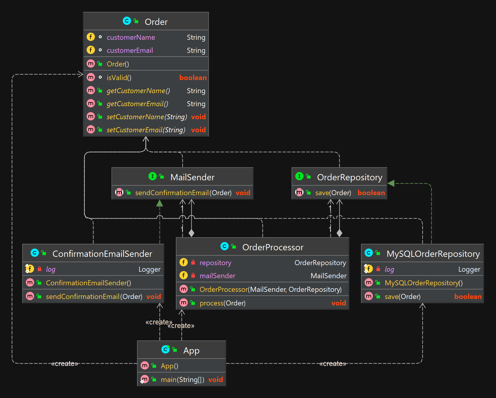

## Принцип инверсии зависимостей (DIP)

### Объяснение

В процессе разработки программного обеспечения существует момент, когда функционал приложения перестаёт помещаться в рамках одного модуля. Когда это происходит, нам приходится решать проблему зависимостей модулей. В результате, например, может оказаться так, что высокоуровневые компоненты зависят от низкоуровневых компонентов.
Программное обеспечение нужно разрабатывать так, чтобы различные модули были автономными и соединялись друг с другом с помощью абстракции.

Классическое применение этого принципа — Spring framework. В рамках Spring framework все модули выполнены в виде отдельных компонентов, которые могут работать вместе. Они настолько автономны, что могут быть быть с такой же легкостью задействованы в других программных модулях помимо Spring framework.

Это достигнуто за счет зависимости закрытых и открытых принципов. Все модули предоставляют доступ только к абстракции, которая может использоваться в другом модуле.

 * Взаимодействие между классами должно быть реализовано через интерфейсы или абстрактные классы
 * Типами всех членов классов должны быть интерфейсы или абстрактные классы
 * Классы, являющиеся конечными реализациями не должны расширяться (или должны быть финальными)
 * Аналогично методы не должны перекрываться при наследовании (или быть финальными)

**Программный пример**
 
Попробуем продемонстрировать это на примере:

```java
public class OrderProcessor {
    public void process(Order order){

        MySQLOrderRepository repository = new MySQLOrderRepository();
        ConfirmationEmailSender mailSender = new ConfirmationEmailSender();

        if (order.isValid() && repository.save(order)) {
            mailSender.sendConfirmationEmail(order);
        }
    }

}
```
В данном примере наш OrderProcessor зависит от двух конкретных классов MySQLOrderRepository и ConfirmationEmailSender. Приведем также код данных классов:
```java
public class MySQLOrderRepository {
    public boolean save(Order order) {
        MySqlConnection connection = new MySqlConnection("database.url");
        // сохраняем заказ в базу данных

        return true;
    }
}

public class ConfirmationEmailSender {
    public void sendConfirmationEmail(Order order) {
        String name = order.getCustomerName();
        String email = order.getCustomerEmail();

        // Шлем письмо клиенту
    }
}
```
Эти классы далеки от того, чтобы называться абстракциями. И с точки зрения принципа DIP было бы правильнее для начала создать некоторые абстракции, которые позволят нам оперировать в дальнейшем ими, а не конкретными реализациями. Создадим два интерфейса MailSender и OrderRepository, которые и станут нашими абстракциями:
```java
public interface MailSender {
    void sendConfirmationEmail(Order order);
}

public interface OrderRepository {
    boolean save(Order order);
}
```
Теперь имплементируем данные интерфейсы в уже готовых для этого классах:

```java
public class ConfirmationEmailSender implements MailSender {

    @Override
    public void sendConfirmationEmail(Order order) {
        String name = order.getCustomerName();
        String email = order.getCustomerEmail();

        // Шлем письмо клиенту
    }

}

public class MySQLOrderRepository implements OrderRepository {

    @Override
    public boolean save(Order order) {
        MySqlConnection connection = new MySqlConnection("database.url");
        // сохраняем заказ в базу данных

        return true;
    }
}
```
Мы провели подготовительную работу, чтобы наш класс OrderProcessor зависит не от конкретных деталей, а от абстракций. Внесем в него изменения, внедряя наши зависимости в конструкторе класса:

```java
public class OrderProcessor {

    private MailSender mailSender;
    private OrderRepository repository;

    public OrderProcessor(MailSender mailSender, OrderRepository repository) {
        this.mailSender = mailSender;
        this.repository = repository;
    }

    public void process(Order order){
        if (order.isValid() && repository.save(order)) {
            mailSender.sendConfirmationEmail(order);
        }
    }
}
```

Теперь наш класс зависит от абстракций, а не от конкретных реализаций. Можно без труда менять его поведение, внедряя нужную зависимость в момент создания экземпляра OrderProcessor.
## Диаграмма классов




## Туториалы

* [Пять основных принципов дизайна классов (S.O.L.I.D.) в Java](https://javarush.com/groups/posts/osnovnye-principy-dizajna-klassov-solid-v-java)
