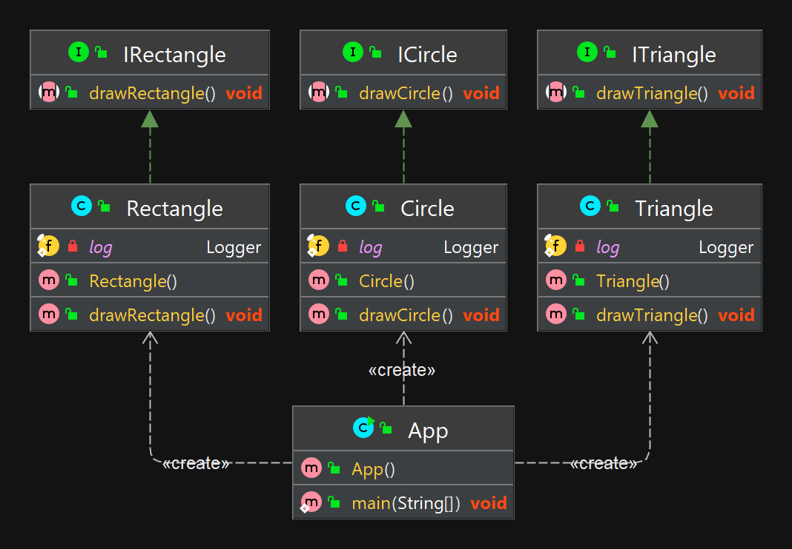

## Принцип разделения интерфейса (ISP)

### Объяснение

Принцип разделения интерфейсов (англ. Interface Segregation Principle, ISP) - это принцип SOLID, который гласит, что клиенты не должны зависеть от интерфейсов, которые они не используют. Вместо этого следует создавать множество узкоспециализированных интерфейсов, каждый из которых предоставляет только те методы, которые необходимы клиенту.  Принцип разделения интерфейсов позволяет уменьшить связность между компонентами системы и улучшить ее расширяемость и поддерживаемость.

**Программный пример**

Рассмотрим интерфейс Shape:

```java
interface Shape {
    drawCircle();
    drawSquare();
    drawRectangle();
}
```
Он описывает методы для рисования кругов (drawCircle), квадратов (drawSquare) и прямоугольников (drawRectangle). В результате классы, реализующие этот интерфейс и представляющие отдельные геометрические фигуры, такие, как круг (Circle), квадрат (Square) и прямоугольник (Rectangle), должны содержать реализацию всех этих методов. Выглядит это так:

```java
class Circle implements Shape {
    drawCircle(){
        //...
    }
    drawSquare(){
        //...
    }
    drawRectangle(){
        //...
    }
}
class Square implements Shape {
    drawCircle(){
        //...
    }
    drawSquare(){
        //...
    }
    drawRectangle(){
        //...
    }
}
class Rectangle implements Shape {
    drawCircle(){
        //...
    }
    drawSquare(){
        //...
    }
    drawRectangle(){
        //...
    }
}
```
класс Rectangle, представляющий прямоугольник, реализует методы (drawCircle и drawSquare), которые ему совершенно не нужны. То же самое можно заметить и при анализе кода двух других классов.


Предположим, мы решим добавить в интерфейс Shape ещё один метод, drawTriangle, предназначенный для рисования треугольников:
```java
interface Shape {
    drawCircle();
    drawSquare();
    drawRectangle();
    drawTriangle();
}

```
Это приведёт к тому, что классам, представляющим конкретные геометрические фигуры, придётся реализовывать ещё и метод drawTriangle. В противном случае возникнет ошибка.

Как видно, при таком подходе невозможно создать класс, который реализует метод для вывода круга, но не реализует методы для вывода квадрата, прямоугольника и треугольника. Такие методы можно реализовать так, чтобы при их выводе выбрасывалась бы ошибка, указывающая на то, что подобную операцию выполнить невозможно.

Принцип разделения интерфейса предостерегает нас от создания интерфейсов, подобных Shape из нашего примера. Клиенты (у нас это классы Circle, Square и Rectangle) не должны реализовывать методы, которые им не нужно использовать. Кроме того, этот принцип указывает на то, что интерфейс должен решать лишь какую-то одну задачу (в этом он похож на принцип единственной ответственности), поэтому всё, что выходит за рамки этой задачи, должно быть вынесено в другой интерфейс или интерфейсы.

В нашем же случае интерфейс Shape решает задачи, для решения которых необходимо создать отдельные интерфейсы. Следуя этой идее, переработаем код, создав отдельные интерфейсы для решения различных узкоспециализированных задач:

```java
interface Shape {
    draw();
}
interface ICircle {
    drawCircle();
}
interface ISquare {
    drawSquare();
}
interface IRectangle {
    drawRectangle();
}
interface ITriangle {
    drawTriangle();
}
class Circle implements ICircle {
    drawCircle() {
        //...
    }
}
class Square implements ISquare {
    drawSquare() {
        //...
    }
}
class Rectangle implements IRectangle {
    drawRectangle() {
        //...
    }
}
class Triangle implements ITriangle {
    drawTriangle() {
        //...
    }
}
class CustomShape implements Shape {
    draw(){
        //...
    }
}
```
Теперь интерфейс ICircle используется лишь для рисования кругов, равно как и другие специализированные интерфейсы — для рисования других фигур. Интерфейс Shape может применяться в качестве универсального интерфейса.


## Диаграмма классов




## Туториалы

* [ISP (Interface segregation principle) - Принцип разделения интерфейса](https://makedev.org/principles/solid/isp.html)
