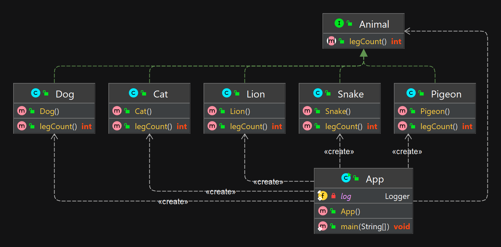

## Принцип подстановки Барбары Лисков (LSP)


### Объяснение

Это вариация принципа открытости/закрытости. Его можно описать так: объекты в программе можно заменить их наследниками без изменения свойств программы.

Это означает, что класс, разработанный путем расширения на основании базового класса, должен переопределять его методы так, чтобы не нарушалась функциональность с точки зрения клиента. То есть, если разработчик расширяет ваш класс и использует его в приложении, он не должен изменять ожидаемое поведение переопределенных методов.

Подклассы должны переопределять методы базового класса так, чтобы не нарушалась функциональность с точки зрения клиента. Подробно это можно рассмотреть на следующем примере.

Цель этого принципа заключаются в том,
чтобы классы-наследники могли бы использоваться вместо родительских классов,
от которых они образованы, не нарушая работу программы. Если оказывается, что в коде 
проверяется тип класса, значит принцип подстановки нарушается.

Мы хотим перебрать список животных, каждое из которых представлено объектом класса Animal,
и узнать о том, какие звуки они издают. Представим, что мы решаем эту задачу с помощью функции makeSound()

**Программный пример**

Рассмотрим применение этого принципа, вернувшись к примеру с классом Animal. Напишем функцию, предназначенную для возврата информации о количествах конечностей животного.

```java
  List<Animal> animals = Arrays.asList(new Cat(), new Dog(), new Lion(), new Pigeon(), new Snake());
        for (Animal animal : animals ) {
        if(animal instanceof Cat)
        legCount = 4;
        if(animal instanceof Dog)
        legCount = 4;
        if(animal instanceof Lion)
        legCount = 4;
        if(animal instanceof Pigeon)
        legCount = 2;
        if(animal instanceof Snake)
        legCount = 0;
        }
```
Функция нарушает принцип подстановки (и принцип открытости-закрытости). 
Этот код должен знать о типах всех обрабатываемых им объектов и, в зависимости от типа, 
обращаться к соответствующей функции для подсчёта конечностей конкретного животного. 
Как результат, при создании нового типа животного функцию придётся переписывать.

Так же нарушение принципа можно проследить на основе класса Snake, имплементирующего интерфейс животного:
```java
public class Snake implements Animal{
    @Override
    public int legCount() {
        throw new RuntimeException("Snake has no legs");
    }
}
```
Однако в данном классе мы нарушили принцип LSP, так как вместо того, 
чтобы вернуть int, наш метод бросает исключение RuntimeException. 
Клиенты данного кода не рассчитывают на такое: они ожидают возвращения true или false. 
Это может привести к ошибкам в работе программы.


Для того чтобы эта функция не нарушала принцип подстановки, преобразуем её с использованием требований, сформулированных Стивом Фентоном. Они заключаются в том, что методы, принимающие или возвращающие значения с типом некоего суперкласса (Animal в нашем случае) должны также принимать и возвращать значения, типами которых являются его подклассы (Pigeon).

```java
public interface Animal {
    int legCount();
}

public class Cat implements Animal{
    @Override
    public int legCount() {
        return 4;
    }
}

public class Pigeon implements Animal {
    @Override
    public int legCount() {
        return 2;
    }
}

public class Dog implements Animal {
    @Override
    public int legCount() {
        return 4;
    }
}

```
Теперь эта функция не интересуется типами передаваемых ей объектов. 
Она просто вызывает их методы LegCount. Всё, что она знает о типах — это то, 
что обрабатываемые ей объекты должны принадлежать классу Animal или его подклассам.


```java
     List<Animal> goodAnimals = Arrays.asList(new Cat(), new Dog(), new Lion());
        for (Animal animal : goodAnimals) {
        log.info("leg count for {} is : {}", animal.getClass().getSimpleName(), animal.legCount());
        }

```


## Диаграмма классов




## Туториалы

* [Принципы SOLID, о которых должен знать каждый разработчик](https://habr.com/ru/companies/ruvds/articles/426413/)
* [Пять основных принципов дизайна классов (S.O.L.I.D.) в Java](https://javarush.com/groups/posts/osnovnye-principy-dizajna-klassov-solid-v-java)
