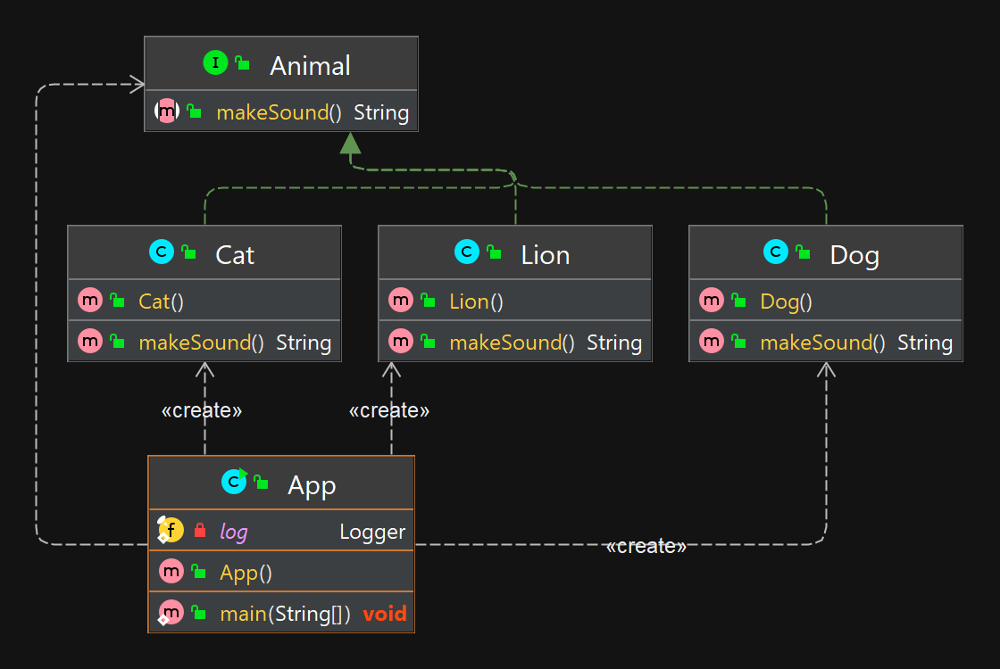

## Принцип открытости/закрытости (OCP)


### Объяснение
Этот принцип емко описывают так: программные сущности (классы, модули, функции и т.п.) должны быть открыты для расширения, но закрыты для изменения.

Это означает, что должна быть возможность изменять внешнее поведение класса, не внося физические изменения в сам класс. Следуя этому принципу, классы разрабатываются так, чтобы для подстройки класса к конкретным условиям применения было достаточно расширить его и переопределить некоторые функции.

Поэтому система должна быть гибкой, с возможностью работы в переменных условиях без изменения исходного кода.

**Пример из реальной жизни**

Мы хотим перебрать список животных, каждое из которых представлено объектом класса Animal, 
и узнать о том, какие звуки они издают. Представим, что мы решаем эту задачу с помощью функции makeSound()

**Программный пример**

При плохой реализации, нам пришлось бы изменять код каждый раз, при добавлении нового животного:

Самая главная проблема такой архитектуры заключается в том, что функция определяет то, какой звук издаёт то или иное животное, анализируя конкретные объекты. Функция AnimalSound не соответствует принципу открытости-закрытости, так как, например, при появлении новых видов животных, нам, для того, чтобы с её помощью можно было бы узнавать звуки, издаваемые ими, придётся её изменить.
```java
String animalSound;
//bad
List<Animal> animals = Arrays.asList(new Cat(), new Dog(), new Lion());
for (Animal animal : animals ) {
if(animal instanceof Cat)
animalSound = "meow";
if(animal instanceof Dog)
animalSound = "gaw-gaw";
if(animal instanceof Lion)
animalSound = "roar";
}
```
При добавлении в массив нового животного придётся дополнять код функции. Пример это очень простой, но если подобная архитектура используется в реальном проекте, функцию придётся постоянно расширять, добавляя в неё новые выражения if.

Как привести функцию AnimalSound в соответствие с принципом открытости-закрытости? Например — так:

у нас есть интерфейс, описывающий животное:

```java
public interface Animal {
    String makeSound();
}
```
```java
public class Cat implements Animal{

    @Override
    public String makeSound() {
        return "meow";
    }
}

public class Dog implements Animal{
    @Override
    public String makeSound() {
        return "gaw-gaw";
    }
}

public class Lion implements Animal{
    @Override
    public String makeSound() {
        return "roar";
    }
}

```

Можно заметить, что у класса Animal теперь есть виртуальный метод makeSound. При таком подходе нужно, чтобы классы, предназначенные для описания конкретных животных, расширяли бы класс Animal и реализовывали бы этот метод.

В результате у каждого класса, описывающего животного, будет собственный метод makeSound, а при переборе массива с животными в функции AnimalSound достаточно будет вызвать этот метод для каждого элемента массива.

Если теперь добавить в массив объект, описывающий новое животное, функцию AnimalSound менять не придётся. Мы привели её в соответствие с принципом открытости-закрытости.

А вот сценарий издавания звука) :


```java
 List<Animal> goodAnimals = Arrays.asList(new Cat(), new Dog(), new Lion());
        for (Animal animal : goodAnimals) {
        log.info("animalSound for {} is : {}", animal.getClass().getSimpleName(), animal.makeSound());
        }
```
Вывод в консоль:
```java
13:50:57.602 [main] INFO solid.ocp.impl.App - animalSound for Cat is : meow
13:50:57.605 [main] INFO solid.ocp.impl.App - animalSound for Dog is : gaw-gaw
13:50:57.605 [main] INFO solid.ocp.impl.App - animalSound for Lion is : roar
```


## Диаграмма классов




## Туториалы

* [Принципы SOLID, о которых должен знать каждый разработчик](https://habr.com/ru/companies/ruvds/articles/426413/)
* [Принцип открытости-закрытости](https://habr.com/ru/companies/tinkoff/articles/472186/)
