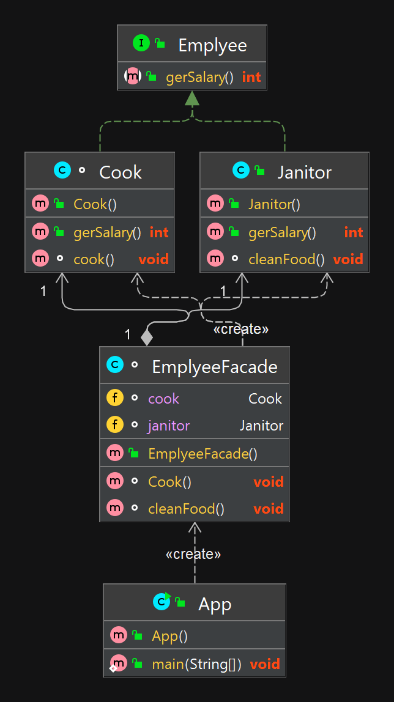

## Принцип единственной ответственности (SRP)


### Объяснение
Принцип единственной ответственности — The Single Responsibility Principle или SRP — один из пяти основных принципов объектно-ориентированного программирования и проектирования, сформулированных Робертом Мартином.

Данный принцип гласит: никогда не должно быть больше одной причины изменить класс.

На каждый объект возлагается одна обязанность, полностью инкапсулированная в класс. Все сервисы класса направлены на обеспечение этой обязанности.

Такие классы всегда будет просто изменять, если это понадобится, потому что понятно, за что класс отвечает, а за что — нет. То есть можно будет вносить изменения и не бояться последствий — влияния на другие объекты. А еще подобный код гораздо проще тестировать, ведь вы покрываете тестами одну функциональность в изоляции от всех остальных.

**Пример из реальной жизни**

Представьте себе модуль , описывающий класс рабочего, в чьи обязанности входит готовка и уборка.
Такой модуль может измениться по нескольким причинам:

* Во-первых может стать другой логика выплаты заработной платы.
* Во-вторых, может изменится логика готовки и уборки

Это простейшие примеры, но в более сложных приложениях таких причин может быть огромное множество.

Принцип единственной обязанности подразумевает, 
что аспекты этих проблем на самом деле — абсолютно разные обязанности. А значит, должны находиться в разных классах или модулях. Объединение нескольких сущностей, которые могут меняться в разное время и по разным причинам, считается плохим проектным решением.
**Программнй пример**

Возьмем в пример нашего работника:

Во-первых, у нас есть интерфейс, описывающие базовый функционал работника и его имплементации.
```java
interface Employee {
    int gerSalary();
}

/**
 * Класс повара
 */
class Cook implements Employee {

    @Override
    public int gerSalary() {
        return 15;
    }

    void cook() {
        System.out.println("Cook.");
    }
}

/**
 * Класс уброщика
 */
public class Janitor implements Employee {
    @Override
    public int gerSalary() {
        return 10;
    }

    void cleanFood() {
        System.out.println("Clean food.");
    }
}
```
То есть мы разделили модуль на два отдельных, каждый из которых будет выполнять одну единственную функцию.

Потом простой фасадный класс класс, объединяющий бизнес логику базовых имплементаций.

```java
class EmployeeFacade {
    Cook cook = new Cook();
    Janitor janitor = new Janitor();

    void Cook() {
        cook.cook();
    }

    void cleanFood() {
        janitor.cleanFood();
    }
}
```

А вот сценарий работы нашего сотрудника

```java
 EmployeeFacade empolyeeFacade = new EmployeeFacade();
        empolyeeFacade.cleanFood();
        empolyeeFacade.cook();
```


## Диаграмма классов




## Туториалы

* [Принцип единственной ответственности: глубокое погружение](https://habr.com/ru/articles/465507/)
* [Принципы SOLID: принцип единственной ответственности](https://web-creator.ru/articles/solid_the_single_responsibility_principle)
