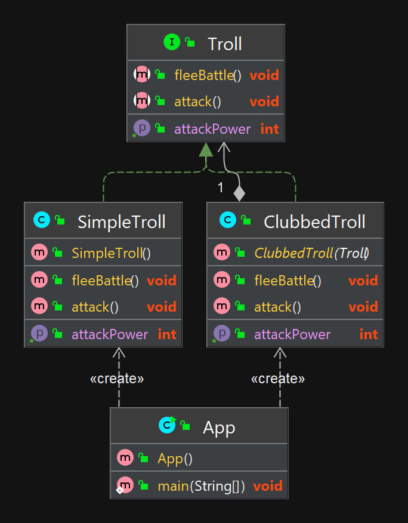

## Альтернативное название 

Wrapper

## Объяснение


В объектно-ориентированном программировании шаблон декоратора — это шаблон проектирования, который позволяет добавлять поведение к отдельному объекту статически или динамически, не влияя на поведение других объектов того же класса. Шаблон декоратора часто полезен для соблюдения принципа единой ответственности, поскольку он позволяет разделить функциональность между классами с уникальными областями ответственности, а также принципа открытости-закрытости, позволяя расширять функциональность класса, не изменяя его. модифицированный.

**Пример**

Возьмем пример с троллем. Прежде всего, у нас есть SimpleTroll реализация Troll интерфейса:

```java
public interface Troll {
  void attack();
  int getAttackPower();
  void fleeBattle();
}

@Slf4j
public class SimpleTroll implements Troll {

  @Override
  public void attack() {
    LOGGER.info("The troll tries to grab you!");
  }

  @Override
  public int getAttackPower() {
    return 10;
  }

  @Override
  public void fleeBattle() {
    LOGGER.info("The troll shrieks in horror and runs away!");
  }
}
```

Далее мы хотим добавить дубинку для тролля. Мы можем сделать это динамически с помощью декоратора:
```java
@Slf4j
public class ClubbedTroll implements Troll {

  private final Troll decorated;

  public ClubbedTroll(Troll decorated) {
    this.decorated = decorated;
  }

  @Override
  public void attack() {
    decorated.attack();
    LOGGER.info("The troll swings at you with a club!");
  }

  @Override
  public int getAttackPower() {
    return decorated.getAttackPower() + 10;
  }

  @Override
  public void fleeBattle() {
    decorated.fleeBattle();
  }
}
```

работа паттерна:

```java
// simple troll
LOGGER.info("A simple looking troll approaches.");
var troll = new SimpleTroll();
troll.attack();
troll.fleeBattle();
LOGGER.info("Simple troll power: {}.\n", troll.getAttackPower());

// change the behavior of the simple troll by adding a decorator
LOGGER.info("A troll with huge club surprises you.");
var clubbedTroll = new ClubbedTroll(troll);
clubbedTroll.attack();
clubbedTroll.fleeBattle();
LOGGER.info("Clubbed troll power: {}.\n", clubbedTroll.getAttackPower());
```

вывод в консоль:

```java
A simple looking troll approaches.
The troll tries to grab you!
The troll shrieks in horror and runs away!
Simple troll power: 10.

A troll with huge club surprises you.
The troll tries to grab you!
The troll swings at you with a club!
The troll shrieks in horror and runs away!
Clubbed troll power: 20.
```

## Диаграмма классов



## Применимость

Шаблон «Декоратор» полезен, когда нужно динамически предоставлять объектам дополнительные возможности. Это хорошая альтернатива наследованию в том случае, когда в логике программы не нужно учитывать конкретные типы декорируемых объектов.

## Туториалы

* [Decorator Pattern Tutorial](https://www.journaldev.com/1540/decorator-design-pattern-in-java-example)
