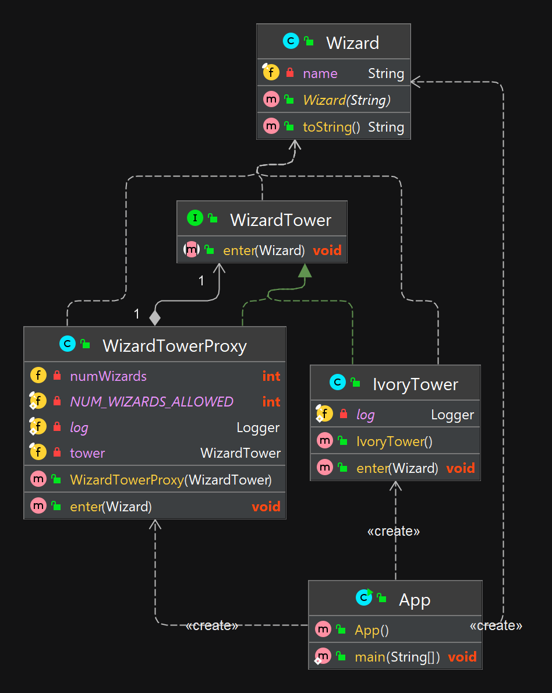

## Альтернативное название

Surrogate

## Объяснение
Главная проблема - необходимо контролировать доступ к объекту, не изменяя при этом поведение клиента.

Proxy — это структурный паттерн проектирования, предоставляющий объект, который, в свою очередь, контролирует доступ к другому объекту путем перехвата всех вызовов. Также можно сказать, что шаблон "Заместитель" выполняет функцию контейнера. Рассмотрим примеры его реализации и использования.

При проектировании сложных систем, достаточно часто возникает необходимость обеспечить контролируемый доступ к определенным объектам системы. Мотивацией для этого служит ряд приобретаемых преимуществ. Таких как, ленивая инициализация по требованию для «громоздких» объектов, подсчет количества ссылок на объект и т.д. и т.п. Однако, не всегда потребность в контролируемом доступе к объекту базируется только на преимуществах. Как правило, сложность процессов реального мира, ограничения вычислительных ресурсов просто не оставляют проектировщику выбора, нежели как воспользоваться паттерном «Заместитель» («Сурогат»).

Идея паттерна «Заместитель» заключается в предоставлении клиенту другого объекта (заместителя), взамен объекту с контролируемым доступом. При этом, объект-заместитель, реализует тот-же интерфейс, что и оригинальный объект, в результате чего, поведение клиента не требует изменений. Иными словами, клиент взаимодействует с заместителем ровно как с оригинальным объектом посредством единого интерфейса. Клиент, так же, не делает предположений о том работает ли он с реальным объектом или его заместителем. Контролирование доступа к объекту, при этом, достигается за счет использования ссылки на него в заместителе, благодаря которой заместитель переадресовывает внешние вызовы контролируемому объекту, возможно сопровождая их дополнительными операциями.
**Пример**

Пример из реальной жизни

Представьте себе башню, куда местные волшебники ходят изучать свои заклинания. Доступ к башне из слоновой кости возможен только через прокси-сервер, который гарантирует, что только первые три волшебника смогут войти. Здесь прокси представляет собой функциональность башни и добавляет к ней контроль доступа.

Простыми словами

Используя шаблон прокси, класс представляет функциональность другого класса.

**Программнй пример**

Возьмем пример с нашей башни волшебников.
Во-первых, у нас есть WizardTower интерфейс и IvoryTower класс.
```java
public interface WizardTower {

  void enter(Wizard wizard);
}

@Slf4j
public class IvoryTower implements WizardTower {

  public void enter(Wizard wizard) {
    LOGGER.info("{} enters the tower.", wizard);
  }

}
```
Потом простой Wizard класс.

```java
public class Wizard {

  private final String name;

  public Wizard(String name) {
    this.name = name;
  }

  @Override
  public String toString() {
    return name;
  }
}
```

Затем у нас есть возможность WizardTowerProxy добавить контроль доступа к WizardTower.

```java
@Slf4j
public class WizardTowerProxy implements WizardTower {

  private static final int NUM_WIZARDS_ALLOWED = 3;

  private int numWizards;

  private final WizardTower tower;

  public WizardTowerProxy(WizardTower tower) {
    this.tower = tower;
  }

  @Override
  public void enter(Wizard wizard) {
    if (numWizards < NUM_WIZARDS_ALLOWED) {
      tower.enter(wizard);
      numWizards++;
    } else {
      LOGGER.info("{} is not allowed to enter!", wizard);
    }
  }
}
```

А вот сценарий входа в башню.

```java
var proxy = new WizardTowerProxy(new IvoryTower());
proxy.enter(new Wizard("Red wizard"));
proxy.enter(new Wizard("White wizard"));
proxy.enter(new Wizard("Black wizard"));
proxy.enter(new Wizard("Green wizard"));
proxy.enter(new Wizard("Brown wizard"));
```

Вывод программы:
```
Red wizard enters the tower.
White wizard enters the tower.
Black wizard enters the tower.
Green wizard is not allowed to enter!
Brown wizard is not allowed to enter!
```

## Диаграмма классов



## Применимость

Ленивая инициализация (виртуальный прокси). Когда у вас есть тяжёлый объект, грузящий данные из файловой системы или базы данных.

Вместо того, чтобы грузить данные сразу после старта программы, можно сэкономить ресурсы и создать объект тогда, когда он действительно понадобится.

Защита доступа (защищающий прокси). Когда в программе есть разные типы пользователей, и вам хочется защищать объект от неавторизованного доступа. Например, если ваши объекты – это важная часть операционной системы, а пользователи – сторонние программы (хорошие или вредоносные).

Прокси может проверять доступ при каждом вызове и передавать выполнение служебному объекту, если доступ разрешён.

Локальный запуск сервиса (удалённый прокси). Когда настоящий сервисный объект находится на удалённом сервере.

В этом случае заместитель транслирует запросы клиента в вызовы по сети в протоколе, понятном удалённому сервису.

Логирование запросов (логирующий прокси). Когда требуется хранить историю обращений к сервисному объекту.

Заместитель может сохранять историю обращения клиента к сервисному объекту.

Кеширование объектов («умная» ссылка). Когда нужно кешировать результаты запросов клиентов и управлять их жизненным циклом.

Заместитель может подсчитывать количество ссылок на сервисный объект, которые были отданы клиенту и остаются активными. Когда все ссылки освобождаются, можно будет освободить и сам сервисный объект (например, закрыть подключение к базе данных).

Кроме того, Заместитель может отслеживать, не менял ли клиент сервисный объект. Это позволит использовать объекты повторно и здóрово экономить ресурсы, особенно если речь идёт о больших прожорливых сервисах.
## Туториалы

* [Controlling Access With Proxy Pattern](http://java-design-patterns.com/blog/controlling-access-with-proxy-pattern/)
* [Паттерн проектирования «Заместитель» / «Proxy»](https://habr.com/ru/articles/88722/)